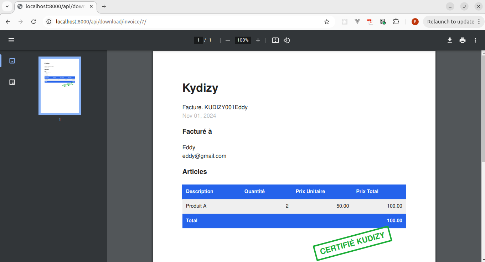

# invoice-api

This is a Django-based API designed for invoice generation as part of the Kudizy interview process

# Environment

- Python version: 3.11.9
- create a virtual environment: `python -m venv .invoice`
- activate the virtual environment: `source .invoice/bin/activate`
- install dependencies: `pip install -r requirements.txt`

# Development process

- For each new feature, a TDD approach is adopted
- The app is firstly created on the feature branch. After merging the newly created app on the test branch, the tests are written, triggering a TDD process

# Business considerations

- If an invoice number is empty in the file, a new invoice is created for this specific article
- If specified, an invoice number should be at least 4 character length
  - An empty invoice number is converted to 'nan' in the database
  - A 'nan' invoice number is converted to 'nan' in the database
  - In order to avoid misconception related to the two precedent cases, a suitable invoice number format should be adopted by the business

# Example of invoice

# Documentation

- The swagger documentation is available at: `http://127.0.0.1:8000/api/schema/swagger-ui/`
